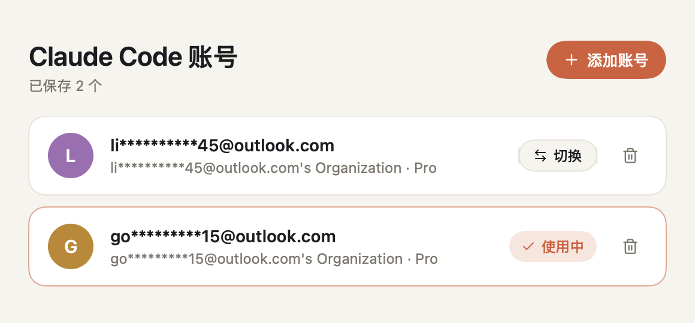

# ccBaton

由于目前版本的 cc-switch 无法实现多个 Claude 账户之间的切换，当前项目实现了一个极简的 Claude 账号管理器，实现在一台 Mac 上保存多个 Claude Code 账号，点一下就切换，不用反复退出再登录。

<picture>
  <source media="(prefers-color-scheme: dark)" srcset="docs/screenshot-dark.png">
  
</picture>


## 一、工作原理

Claude Code 把登录凭据存在钥匙串的 `Claude Code-credentials` 条目里，账号信息存在 `~/.claude.json` 的 `oauthAccount` 字段里。ccBaton 为每个账号单独存一份凭据，切换时把目标账号的凭据和账号信息写回这两处。

- **添加账号**：弹窗里内嵌一个终端，用独立的配置目录运行登录命令，不影响当前登录；登录成功后自动保存。
- **切换账号**：先把当前账号的最新凭据回存，再写入目标账号；写之前备份 `~/.claude.json`。
- **自动回存**：每次回到窗口都会检查当前账号，令牌刷新过就更新存档，避免存档过期。

切换只换登录凭据和账号信息，`~/.claude/` 下的**会话记录、设置、MCP 和 CLAUDE.md 都不动，所有账号共用同一份**。一个账号额度用完，切换后用 `claude --resume` 就能接着之前的会话继续。

切换后，已经打开的 Claude Code 需要重开才会用新账号。

### 桌面端

Claude 桌面端不读上面两处，它的登录状态在 `~/Library/Application Support/Claude/` 里：`Cookies`、`Local Storage`、`Session Storage`、`IndexedDB`、`WebStorage`，以及 `config.json` 里的 `oauth:*` 令牌缓存和 `lastKnownAccountUuid`。这些内容都用本机的 `Claude Safe Storage` 密钥加密，同一台机器上整份复制就能切换，不需要解密。

- **保存 / 切换 / 添加**：都会先退出桌面端（它运行时会把旧状态写回去），操作完再自动重开。
- **切换前回存**：先把当前账号的最新状态存回它的快照；当前账号没保存过时，备份到 `desktop/last-backup`。
- **会话同步**：桌面端 Code 标签页的会话索引按账号存在 `claude-code-sessions/<账号ID>/<组织ID>/` 下（每个会话一个 `local_<ID>.json`，删除后留下 `deleted_<ID>` 标记），对话记录本身在 `~/.claude/projects`，本来就是共用的。每次切换、保存、添加账号，以及桌面端没运行时，ccBaton 会把所有账号的会话索引互相复制一遍：同一个会话保留较新的一份，在任一账号删掉的会话其他账号也删掉。也可以点“同步会话”，把指定账号的会话同步给指定的其他账号，或者关掉自动同步。
- **旧版修复**：旧版用软链接共享会话目录，桌面端读得到但写不进去（`ENOTDIR`），那段时间新建的会话没存下来。新版第一次运行会把软链接换回真实目录，旧共享目录移到 `desktop/sessions-backup/`，并从对话记录里找回这期间桌面端新建的会话。


## 二、功能说明

| 功能 | 说明 |
|---|---|
| 添加账号 | 在内嵌终端里运行 `claude` 后输入 `/login`，或直接运行 `claude auth login` |
| 保存当前账号 | 命令行已登录但没保存过的账号，会在列表顶部提示保存 |
| 切换 | 点账号即切换，当前在用的账号会标出来 |
| 删除 | 只删本应用存的凭据，不会让命令行退出登录 |
| 会话共享 | 各账号共用会话记录和配置，切换后可以继续之前的会话 |
| 同步会话 | 桌面端页的“同步会话”：把指定账号的会话同步给指定账号，开关自动同步 |
| 桌面端 | 顶部切到“桌面端”页，单独管理 Claude 桌面端的账号，右键可改名 |

数据存放位置：

| 位置 | 内容 |
|---|---|
| 钥匙串 `ccBaton-<id>` | 每个账号的登录凭据 |
| `~/Library/Application Support/ccBaton/profiles.json` | 账号列表 |
| `~/Library/Application Support/ccBaton/claude.json.bak` | 最近一次切换前的 `~/.claude.json` 备份 |
| `~/Library/Application Support/ccBaton/desktop/` | 桌面端账号列表、每个账号的登录快照，以及 `sessions-backup/` 旧版共享目录备份 |


## 三、安装和使用

需要 macOS 14 以上、Apple 芯片，以及 Swift 5.9 以上。

```bash
swift run                   # 本地运行
./scripts/build-app.sh      # 打包成 dist/ccBaton.app 并本机签名
```

打包后把 `dist/ccBaton.app` 拖进“应用程序”即可。**安装后占用约 3.7 MB，压缩包约 1.4 MB**。


## 四、社区友链

[LINUX DO](https://linux.do/)：一个关注开发者、开源项目与 AI 工具交流的社区。感谢社区佬友对开源工具和 Agent 工作流的讨论与反馈。
